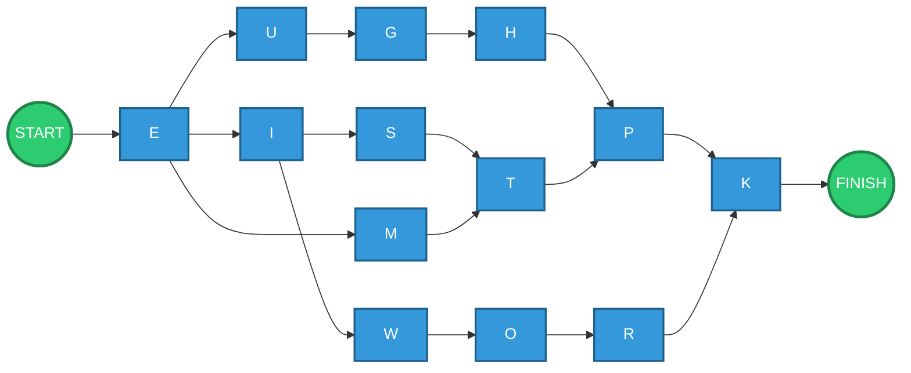
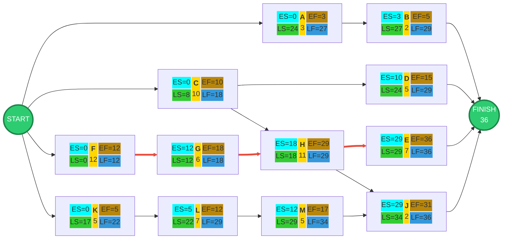
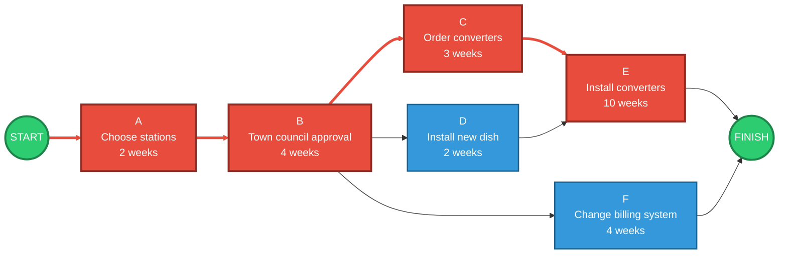

# Information Systems Management of Operations, Quality and Processes
## Group Solutions
## Exercise 1 — Logic Diagram

 ## Problem

 Draw a logic diagram by placing the activities in boxes and connecting them according to their precedence relationships.

 ### Given precedence relationships
 
 1. `U → G → H`
2. `Start → E`
3. `E → U`
4. `E → I`
5. `P → K` and `R → K`
6. `E → M → T`
7. `O → R`
8. `H → P` and `T → P`
9. `O → R`
10. `I → S → T`
11. `T → P`
12. `I → W → O`
13. `H → P`

 The repeated relationships do not need to be represented more than once.

 ## Precedence structure

 The resulting relationships are:

 - Start → E
- E → U → G → H
- E → I → S → T
- E → M → T
- I → W → O → R
- H → P
- T → P
- P → K
- R → K

 ## Logic Diagram


 ## Interpretation

 The network contains two important convergence points:

 - **P** can only begin after both **H** and **T** have been completed.
- **K** can only begin after both **P** and **R** have been completed.

 Therefore, the diagram represents the complete logical dependency structure given in the exercise.

---

# Exercise 2 — Milwaukee Paper ES/EF and LS/LF Network

 ## Objective

 The exercise asks us to:

 1. Add the **Earliest Start (ES)** and **Earliest Finish (EF)** times.
2. Add the **Latest Start (LS)** and **Latest Finish (LF)** times that will not delay the overall project.
3. Identify the **critical path**.

 The network contains 12 activities:

 **A, B, C, D, E, F, G, H, J, K, L, M**

---

 # 1\. Forward Pass — ES and EF

 The **forward pass** moves from **Start → Finish** through the network.

 It determines the earliest possible time each activity can start and finish.

 ### Formulas

 For the first activity:

 $$
ES = 0
$$

 For an activity with one predecessor:

 $$
ES = EF_{\text{predecessor}}
$$

 For an activity with multiple predecessors:

 $$
ES = \max(EF_{\text{all predecessors}})
$$

 Once ES is known:

 $$
EF = ES + Duration
$$

 The important rule for multiple predecessors is therefore:

 > **Take the largest predecessor EF.**

 This ensures that an activity does not start before **all** of its required predecessors have finished.

---

 ## Forward-pass calculations

 ### A

 A has no predecessor:

 $$
ES_A=0
$$

 $$
EF_A=0+3=3
$$

 ### B

 B follows A:

 $$
ES_B=EF_A=3
$$

 $$
EF_B=3+2=5
$$

 ### C

 C starts directly from Start:

 $$
ES_C=0
$$

 $$
EF_C=0+10=10
$$

 ### D

 D follows C:

 $$
ES_D=EF_C=10
$$

 $$
EF_D=10+5=15
$$

 ### F

 F starts directly from Start:

 $$
ES_F=0
$$

 $$
EF_F=0+12=12
$$

 ### G

 G follows F:

 $$
ES_G=EF_F=12
$$

 $$
EF_G=12+6=18
$$

 ### H

 H has two predecessors: C and G.

 Their EF values are:

 $$
EF_C=10
$$

 $$
EF_G=18
$$

 Therefore:

 $$
ES_H=\max(10,18)=18
$$

 $$
EF_H=18+11=29
$$

 ### E

 E has three predecessors: B, D and H.

 Their EF values are:

 $$
EF_B=5
$$

 $$
EF_D=15
$$

 $$
EF_H=29
$$

 Therefore:

 $$
ES_E=\max(5,15,29)=29
$$

 $$
EF_E=29+7=36
$$

 ### K

 K starts directly from Start:

 $$
ES_K=0
$$

 $$
EF_K=0+5=5
$$

 ### L

 L follows K:

 $$
ES_L=5
$$

 $$
EF_L=5+7=12
$$

 ### M

 M follows L:

 $$
ES_M=12
$$

 $$
EF_M=12+5=17
$$

 ### J

 J has two predecessors: H and M.

 $$
EF_H=29
$$

 $$
EF_M=17
$$

 Therefore:

 $$
ES_J=\max(29,17)=29
$$

 $$
EF_J=29+2=31
$$

 The project must wait for both E and J.

 Therefore:

 $$
Project\ Duration=\max(36,31)=36
$$

 So the project completion time is:

 $$
\boxed{36}
$$

---

 # 2\. Backward Pass — LS and LF

 The **backward pass** works in the opposite direction:

 **Finish → Start**

 It determines how late each activity can start and finish **without delaying the overall project completion time**.

 We begin with the project completion time:

 $$
Project\ Finish=36
$$

 ### Formulas

 For the final activity:

 $$
LF=Project\ Duration
$$

 Then:

 $$
LS=LF-Duration
$$

 For an activity with one successor:

 $$
LF=LS_{\text{successor}}
$$

 For an activity with multiple successors:

 $$
LF=\min(LS_{\text{all successors}})
$$

 The important rule for multiple successors is therefore:

 > **Take the smallest successor LS.**

---

 ## Backward-pass calculations

 ### E

 E finishes the main branch:

 $$
LF_E=36
$$

 $$
LS_E=36-7=29
$$

 ### J

 J also leads to project completion:

 $$
LF_J=36
$$

 $$
LS_J=36-2=34
$$

 ### H

 H is a predecessor of both E and J.

 Their LS values are:

 $$
LS_E=29
$$

 $$
LS_J=34
$$

 Therefore:

 $$
LF_H=\min(29,34)=29
$$

 $$
LS_H=29-11=18
$$

 ### M

 M precedes J:

 $$
LF_M=LS_J=34
$$

 $$
LS_M=34-5=29
$$

 ### L

 L precedes M:

 $$
LF_L=LS_M=29
$$

 $$
LS_L=29-7=22
$$

 ### K

 K precedes L:

 $$
LF_K=LS_L=22
$$

 $$
LS_K=22-5=17
$$

 ### G

 G precedes H:

 $$
LF_G=LS_H=18
$$

 $$
LS_G=18-6=12
$$

 ### F

 F precedes G:

 $$
LF_F=LS_G=12
$$

 $$
LS_F=12-12=0
$$

 ### D

 D precedes E:

 $$
LF_D=LS_E=29
$$

 $$
LS_D=29-5=24
$$

 ### C

 C has two successors: D and H.

 Their LS values are:

 $$
LS_D=24
$$

 $$
LS_H=18
$$

 Therefore:

 $$
LF_C=\min(24,18)=18
$$

 $$
LS_C=18-10=8
$$

 ### B

 B precedes E:

 $$
LF_B=LS_E=29
$$

 $$
LS_B=29-2=27
$$

 ### A

 A precedes B:

 $$
LF_A=LS_B=27
$$

 $$
LS_A=27-3=24
$$

---

 # 3\. Summary Table

 | Activity | Duration | ES | EF | LS | LF | Float |
| --- | --- | --- | --- | --- | --- | --- |
| A | 3 | 0 | 3 | 24 | 27 | 24 |
| B | 2 | 3 | 5 | 27 | 29 | 24 |
| C | 10 | 0 | 10 | 8 | 18 | 8 |
| D | 5 | 10 | 15 | 24 | 29 | 14 |
| E | 7 | 29 | 36 | 29 | 36 | **0** |
| F | 12 | 0 | 12 | 0 | 12 | **0** |
| G | 6 | 12 | 18 | 12 | 18 | **0** |
| H | 11 | 18 | 29 | 18 | 29 | **0** |
| J | 2 | 29 | 31 | 34 | 36 | 5 |
| K | 5 | 0 | 5 | 17 | 22 | 17 |
| L | 7 | 5 | 12 | 22 | 29 | 17 |
| M | 5 | 12 | 17 | 29 | 34 | 17 |

### Float calculation

 Float is calculated as:

 $$
Float=LS-ES
$$

 or equivalently:

 $$
Float=LF-EF
$$

 For example, activity C:

 $$
Float_C=8-0=8
$$

 Activity F:

 $$
Float_F=0-0=0
$$

---

 # 4\. Critical Path

 An activity is **critical when its total float is zero**.

 From the table:

 - F → Float = 0
- G → Float = 0
- H → Float = 0
- E → Float = 0

 Therefore:

 $$
\boxed{F\rightarrow G\rightarrow H\rightarrow E}
$$

 is the critical path.

 Its duration is:

 $$
12+6+11+7=36
$$

 Therefore:

 $$
\boxed{\text{Project Duration}=36}
$$

---

 # 5\. Final ES/EF/LS/LF Network

 The node format follows the lecture-style design:

```
┌─────────┬───────────┬─────────┐
│   ES    │ Activity  │   EF    │
├─────────┼───────────┼─────────┤
│   LS    │ Duration  │   LF    │
└─────────┴───────────┴─────────┘
```

 The centre is yellow, the upper-left ES section is cyan, the lower-left LS section is green, the upper-right EF section is dark yellow, and the lower-right LF section is blue.



 # Final Answer

 ### Forward pass

 Calculate:

 $$
\boxed{ES=\text{maximum EF of predecessors}}
$$

 $$
\boxed{EF=ES+Duration}
$$

 This produces the earliest possible schedule.

 ### Backward pass

 Starting from the project completion time of 36:

 $$
\boxed{LF=\text{minimum LS of successors}}
$$

 $$
\boxed{LS=LF-Duration}
$$

 This produces the latest schedule that does not delay the project.

 ### Critical path

 Activities with zero float:

 $$
\boxed{F\rightarrow G\rightarrow H\rightarrow E}
$$

 ### Project duration

 $$
\boxed{36}
$$

 Thus, the **The project requires 36 time units**, and any delay to **F, G, H, or E** will delay the overall project completion.
 
 
 # Exercise 3 — Horizon Cable

 ## Problem

 Horizon Cable is expanding its cable TV service in Smalltown. The activities required to complete the expansion are:

 | Activity | Description | Immediate Predecessors | Duration |
| --- | --- | --- | --- |
| A | Choose stations | — | 2 weeks |
| B | Get town council approval | A | 4 weeks |
| C | Order converters | B | 3 weeks |
| D | Install new dish to receive new stations | B | 2 weeks |
| E | Install converters | C, D | 10 weeks |
| F | Change billing system | B | 4 weeks |

## Precedence relationships

 The network is:

 - A → B
- B → C
- B → D
- B → F
- C → E
- D → E

 Because **E requires both C and D**, E can only begin once both predecessor activities have finished.

---

 ## ROY Diagram



---

 ## Path calculations

 ### Path 1 — A → B → C → E

 $$
2 + 4 + 3 + 10 = 19
$$

 $$
\boxed{19\text{ weeks}}
$$

 ### Path 2 — A → B → D → E

 $$
2 + 4 + 2 + 10 = 18
$$

 $$
\boxed{18\text{ weeks}}
$$

 ### Path 3 — A → B → F

 $$
2 + 4 + 4 = 10
$$

 $$
\boxed{10\text{ weeks}}
$$

---

 ## Critical Path

 The critical path is the longest path through the network.

 Comparing the three paths:

 | Path | Duration |
| --- | --- |
| A → B → C → E | **19 weeks** |
| A → B → D → E | 18 weeks |
| A → B → F | 10 weeks |

Therefore:

 $$
\boxed{\text{Critical Path = A → B → C → E}}
$$

 and:

 $$
\boxed{\text{Project Duration = 19 weeks}}
$$

 ## Float

 The path-level slack is:

 ### D branch

 $$
19 - 18 = 1\text{ week}
$$

 Therefore, the D branch has **1 week of slack**.

 ### F branch

 $$
19 - 10 = 9\text{ weeks}
$$

 Therefore, the F branch has **9 weeks of slack**.

 The critical-path activities have zero float:

 $$
\boxed{A,\ B,\ C,\ E}
$$

---

 # Final Results

 | Exercise | Critical Path | Project Duration |
| --- | --- | --- |
| **Exercise 1** | Cannot be determined — no durations supplied | — |
| **Exercise 2** | **F → G → H → E** | **36** |
| **Exercise 3** | **A → B → C → E** | **19 weeks** |

## Concepts Revision

 These exercises apply the following project-management concepts:

 - **ROY / Activity-on-Node diagrams** — activities are represented as nodes and dependencies as directed arrows.
- **Precedence relationships** — determine which activities can start after others finish.
- **Earliest Start (ES)** — earliest possible time an activity can begin.
- **Earliest Finish (EF)** — earliest possible completion time.
- **Latest Start (LS)** — latest start time that does not delay the project.
- **Latest Finish (LF)** — latest completion time that does not delay the project.
- **Float / Slack** — amount of time an activity can be delayed without delaying the project.
- **Critical Path** — sequence of activities with zero float that determines the minimum project duration.

---

