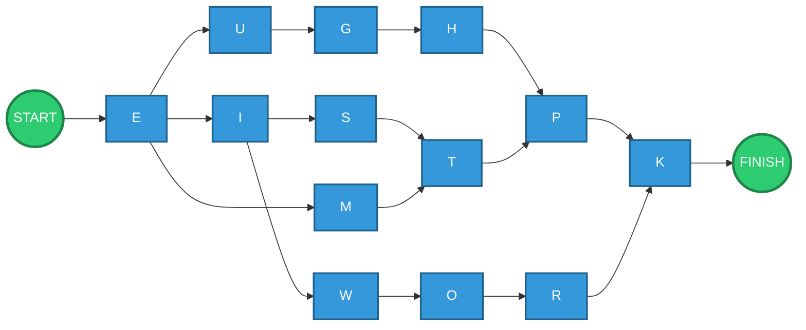
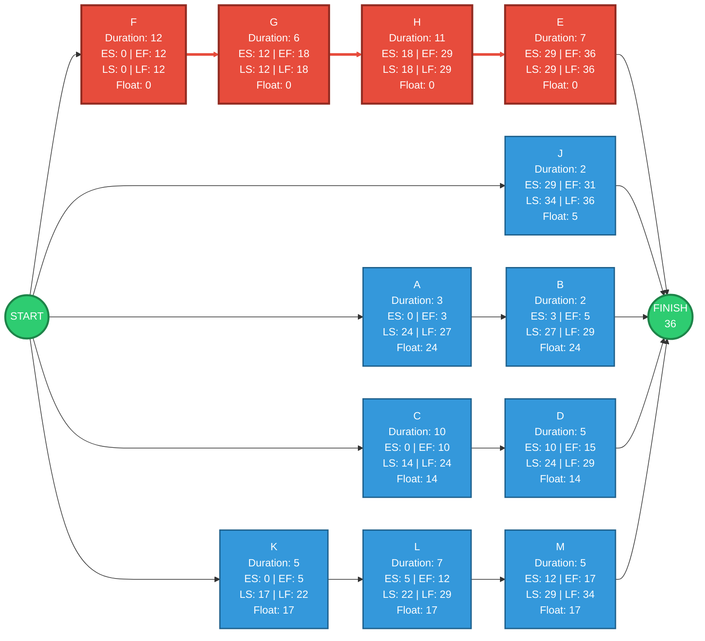
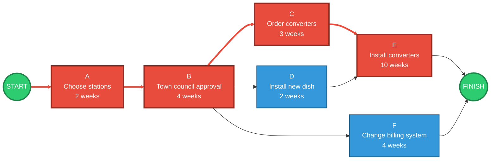

# Information Systems Management of Operations, Quality and Processes
## Group Solutions

 This document contains the solutions for Exercises 1–3, using **ROY (Activity-on-Node)** diagrams and **Critical Path Method (CPM)** calculations.

 ### Diagram colour convention

 | Colour | Meaning |
| --- | --- |
| 🟢 Green | Start / Finish |
| 🔴 Red | Critical-path activity |
| 🔵 Blue | Non-critical activity |
| Thick red arrow | Critical-path relationship |

---

 # Exercise 1 — Logic Diagram

 ## Problem

 Draw a logic diagram by placing the activities in boxes and connecting them according to their precedence relationships.

 ### Given precedence relationships

 1. `U → G → H`
2. `Start → E`
3. `E → U`
4. `E → I`
5. `P → K` and `R → K`
6. `E → M → T`
7. `O → R`
8. `H → P` and `T → P`
9. `O → R`
10. `I → S → T`
11. `T → P`
12. `I → W → O`
13. `H → P`

 The repeated relationships do not need to be represented more than once.

 ## Precedence structure

 The resulting relationships are:

 - Start → E
- E → U → G → H
- E → I → S → T
- E → M → T
- I → W → O → R
- H → P
- T → P
- P → K
- R → K

 ## ROY / Logic Diagram

 ## Interpretation

 The network contains two important convergence points:

 - **P** can only begin after both **H** and **T** have been completed.
- **K** can only begin after both **P** and **R** have been completed.

 Therefore, the diagram represents the complete logical dependency structure given in the exercise.

 > **Note:** No activity durations are provided for Exercise 1, so a critical path cannot be calculated from the information supplied.

---

 # Exercise 2 — CPM Analysis

 ## Objective

 The exercise requires:

 1. Adding the **Earliest Start (ES)** and **Earliest Finish (EF)** times.
2. Adding the **Latest Start (LS)** and **Latest Finish (LF)** times without delaying the overall project.
3. Identifying the **critical path**.

 The supplied data are:

 | Activity | Duration | ES | EF | LS | LF | Float |
| --- | --- | --- | --- | --- | --- | --- |
| A | 3 | 0 | 3 | 24 | 27 | 24 |
| B | 2 | 3 | 5 | 27 | 29 | 24 |
| C | 10 | 0 | 10 | 14 | 24 | 14 |
| D | 5 | 10 | 15 | 24 | 29 | 14 |
| E | 7 | 29 | 36 | 29 | 36 | **0** |
| F | 12 | 0 | 12 | 0 | 12 | **0** |
| G | 6 | 12 | 18 | 12 | 18 | **0** |
| H | 11 | 18 | 29 | 18 | 29 | **0** |
| J | 2 | 29 | 31 | 34 | 36 | 5 |
| K | 5 | 0 | 5 | 17 | 22 | 17 |
| L | 7 | 5 | 12 | 22 | 29 | 17 |
| M | 5 | 12 | 17 | 29 | 34 | 17 |

## CPM formulas

 The main calculations are:

 ### Earliest Finish

 $$
EF = ES + Duration
$$

 ### Latest Start

 $$
LS = LF - Duration
$$

 ### Total Float

 $$
Float = LS - ES
$$

 Equivalently:

 $$
Float = LF - EF
$$

 An activity with **zero float** is a critical activity.

---

 ## Critical activities

 From the supplied table, the activities with zero float are:

 - F
- G
- H
- E

 Therefore:

 $$
\boxed{F \rightarrow G \rightarrow H \rightarrow E}
$$

 is the critical path.

 ## Project duration

 The duration of the critical path is:

 $$
12 + 6 + 11 + 7 = 36
$$

 Therefore:

 $$
\boxed{\text{Project duration} = 36}
$$

 ## CPM Diagram

 The following diagram highlights the critical path in red.

 > **Important:** The original Exercise 2 input graph was not included with the exercise data provided here. The diagram below represents the network implied by the supplied timing table and its critical chain.

flowchart LR
    START(("START"))

    A["<table><tr><td bgcolor='#00FFFF'>ES=0</td><td rowspan='2' bgcolor='#FFD700'><b>A</b> 3</td><td bgcolor='#B8860B'>EF=3</td></tr><tr><td bgcolor='#32CD32'>LS=24</td><td bgcolor='#3498DB'>LF=27</td></tr></table>"]

    B["<table><tr><td bgcolor='#00FFFF'>ES=3</td><td rowspan='2' bgcolor='#FFD700'><b>B</b> 2</td><td bgcolor='#B8860B'>EF=5</td></tr><tr><td bgcolor='#32CD32'>LS=27</td><td bgcolor='#3498DB'>LF=29</td></tr></table>"]

    C["<table><tr><td bgcolor='#00FFFF'>ES=0</td><td rowspan='2' bgcolor='#FFD700'><b>C</b> 10</td><td bgcolor='#B8860B'>EF=10</td></tr><tr><td bgcolor='#32CD32'>LS=14</td><td bgcolor='#3498DB'>LF=24</td></tr></table>"]

    D["<table><tr><td bgcolor='#00FFFF'>ES=10</td><td rowspan='2' bgcolor='#FFD700'><b>D</b> 5</td><td bgcolor='#B8860B'>EF=15</td></tr><tr><td bgcolor='#32CD32'>LS=24</td><td bgcolor='#3498DB'>LF=29</td></tr></table>"]

    F["<table><tr><td bgcolor='#00FFFF'>ES=0</td><td rowspan='2' bgcolor='#FFD700'><b>F</b> 12</td><td bgcolor='#B8860B'>EF=12</td></tr><tr><td bgcolor='#32CD32'>LS=0</td><td bgcolor='#3498DB'>LF=12</td></tr></table>"]

    G["<table><tr><td bgcolor='#00FFFF'>ES=12</td><td rowspan='2' bgcolor='#FFD700'><b>G</b> 6</td><td bgcolor='#B8860B'>EF=18</td></tr><tr><td bgcolor='#32CD32'>LS=12</td><td bgcolor='#3498DB'>LF=18</td></tr></table>"]

    H["<table><tr><td bgcolor='#00FFFF'>ES=18</td><td rowspan='2' bgcolor='#FFD700'><b>H</b> 11</td><td bgcolor='#B8860B'>EF=29</td></tr><tr><td bgcolor='#32CD32'>LS=18</td><td bgcolor='#3498DB'>LF=29</td></tr></table>"]

    E["<table><tr><td bgcolor='#00FFFF'>ES=29</td><td rowspan='2' bgcolor='#FFD700'><b>E</b> 7</td><td bgcolor='#B8860B'>EF=36</td></tr><tr><td bgcolor='#32CD32'>LS=29</td><td bgcolor='#3498DB'>LF=36</td></tr></table>"]

    K["<table><tr><td bgcolor='#00FFFF'>ES=0</td><td rowspan='2' bgcolor='#FFD700'><b>K</b> 5</td><td bgcolor='#B8860B'>EF=5</td></tr><tr><td bgcolor='#32CD32'>LS=17</td><td bgcolor='#3498DB'>LF=22</td></tr></table>"]

    L["<table><tr><td bgcolor='#00FFFF'>ES=5</td><td rowspan='2' bgcolor='#FFD700'><b>L</b> 7</td><td bgcolor='#B8860B'>EF=12</td></tr><tr><td bgcolor='#32CD32'>LS=22</td><td bgcolor='#3498DB'>LF=29</td></tr></table>"]

    M["<table><tr><td bgcolor='#00FFFF'>ES=12</td><td rowspan='2' bgcolor='#FFD700'><b>M</b> 5</td><td bgcolor='#B8860B'>EF=17</td></tr><tr><td bgcolor='#32CD32'>LS=29</td><td bgcolor='#3498DB'>LF=34</td></tr></table>"]

    J["<table><tr><td bgcolor='#00FFFF'>ES=29</td><td rowspan='2' bgcolor='#FFD700'><b>J</b> 2</td><td bgcolor='#B8860B'>EF=31</td></tr><tr><td bgcolor='#32CD32'>LS=34</td><td bgcolor='#3498DB'>LF=36</td></tr></table>"]

    FINISH(("FINISH 36"))

    START --> A
    A --> B

    START --> C
    C --> D

    START --> F
    F --> G
    G --> H
    H --> E

    START --> K
    K --> L
    L --> M

    START --> J

    E --> FINISH
    J --> FINISH
    B --> FINISH
    D --> FINISH
    M --> FINISH

    classDef startEnd fill:#2ecc71,stroke:#1e8449,color:#fff,stroke-width:3px;
    class START,FINISH startEnd;

    %% Critical path: F -> G -> H -> E
    linkStyle 5 stroke:#e74c3c,stroke-width:4px;
    linkStyle 6 stroke:#e74c3c,stroke-width:4px;
    linkStyle 7 stroke:#e74c3c,stroke-width:4px;

 ## Exercise 2 — Final Answer

 $$
\boxed{\text{Critical Path = F → G → H → E}}
$$

 $$
\boxed{\text{Project Duration = 36}}
$$

 Critical activities:

 $$
\boxed{F,\ G,\ H,\ E}
$$

---

 # Exercise 3 — Horizon Cable

 ## Problem

 Horizon Cable is expanding its cable TV service in Smalltown. The activities required to complete the expansion are:

 | Activity | Description | Immediate Predecessors | Duration |
| --- | --- | --- | --- |
| A | Choose stations | — | 2 weeks |
| B | Get town council approval | A | 4 weeks |
| C | Order converters | B | 3 weeks |
| D | Install new dish to receive new stations | B | 2 weeks |
| E | Install converters | C, D | 10 weeks |
| F | Change billing system | B | 4 weeks |

## Precedence relationships

 The network is:

 - A → B
- B → C
- B → D
- B → F
- C → E
- D → E

 Because **E requires both C and D**, E can only begin once both predecessor activities have finished.

---

 ## ROY Diagram

---

 ## Path calculations

 ### Path 1 — A → B → C → E

 $$
2 + 4 + 3 + 10 = 19
$$

 $$
\boxed{19\text{ weeks}}
$$

 ### Path 2 — A → B → D → E

 $$
2 + 4 + 2 + 10 = 18
$$

 $$
\boxed{18\text{ weeks}}
$$

 ### Path 3 — A → B → F

 $$
2 + 4 + 4 = 10
$$

 $$
\boxed{10\text{ weeks}}
$$

---

 ## Critical Path

 The critical path is the longest path through the network.

 Comparing the three paths:

 | Path | Duration |
| --- | --- |
| A → B → C → E | **19 weeks** |
| A → B → D → E | 18 weeks |
| A → B → F | 10 weeks |

Therefore:

 $$
\boxed{\text{Critical Path = A → B → C → E}}
$$

 and:

 $$
\boxed{\text{Project Duration = 19 weeks}}
$$

 ## Float

 The path-level slack is:

 ### D branch

 $$
19 - 18 = 1\text{ week}
$$

 Therefore, the D branch has **1 week of slack**.

 ### F branch

 $$
19 - 10 = 9\text{ weeks}
$$

 Therefore, the F branch has **9 weeks of slack**.

 The critical-path activities have zero float:

 $$
\boxed{A,\ B,\ C,\ E}
$$

---

 # Final Results

 | Exercise | Critical Path | Project Duration |
| --- | --- | --- |
| **Exercise 1** | Cannot be determined — no durations supplied | — |
| **Exercise 2** | **F → G → H → E** | **36** |
| **Exercise 3** | **A → B → C → E** | **19 weeks** |

## Key concepts

 These exercises apply the following project-management concepts:

 - **ROY / Activity-on-Node diagrams** — activities are represented as nodes and dependencies as directed arrows.
- **Precedence relationships** — determine which activities can start after others finish.
- **Earliest Start (ES)** — earliest possible time an activity can begin.
- **Earliest Finish (EF)** — earliest possible completion time.
- **Latest Start (LS)** — latest start time that does not delay the project.
- **Latest Finish (LF)** — latest completion time that does not delay the project.
- **Float / Slack** — amount of time an activity can be delayed without delaying the project.
- **Critical Path** — sequence of activities with zero float that determines the minimum project duration.

---

 ## Summary

 ### Exercise 1

 **Logic network established from the supplied precedence relationships.**

 No durations were supplied, so a critical path cannot be calculated.

 ### Exercise 2

 **Critical Path:**

 $$
\boxed{F \rightarrow G \rightarrow H \rightarrow E}
$$

 **Project Duration:**

 $$
\boxed{36}
$$

 ### Exercise 3

 **Critical Path:**

 $$
\boxed{A \rightarrow B \rightarrow C \rightarrow E}
$$

 **Project Duration:**

 $$
\boxed{19\text{ weeks}}
$$
